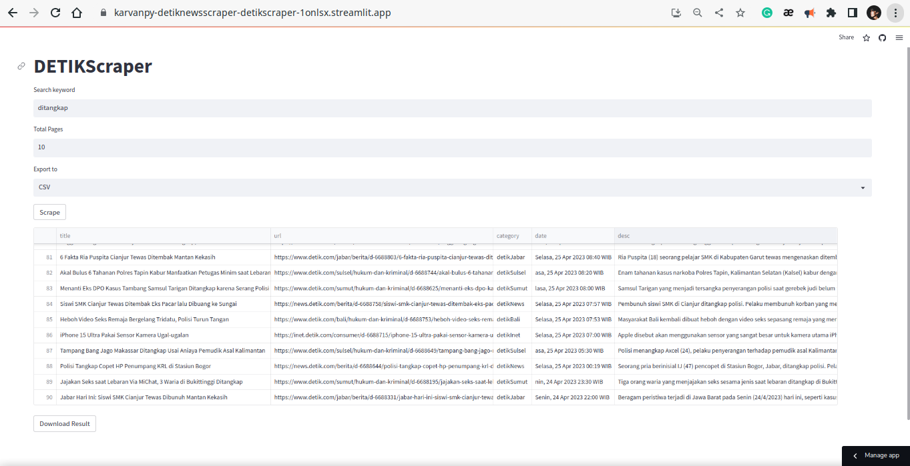

# DETIKNewsScraper
Scraping detik.com by search keywords and total pages.

- Live: https://karvanpy-detiknewsscraper-detikscraper-1onlsx.streamlit.app/



## Build with:
- Python
  - HTTPX
  - selectolax
- Streamlit

## Export result to:
- CSV
- JSON
- XLSX

## How to run locally
1. Install Depedencies
```bash
python -m pip install httpx selectolax streamlit
```

2. Run DETIKScraper.py
```bash
streamlit run DETIKScraper.py
```
