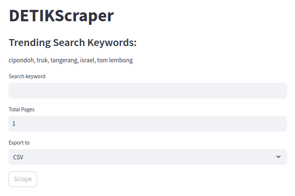

# DETIK News Scraper
=====================

A web scraper for detik.com, allowing users to search and export news articles by keywords and total pages.

## Live Demo
------------

You can try the live demo at: https://detiknewsscraper.streamlit.app/

## Screenshots
-------------

### DETIK News Scraper


### Search Results


## Features
--------

* Search news articles by keywords
* Specify the total number of pages to scrape
* Export results to CSV, JSON, or XLSX files

## Requirements
------------

* Python 3.x
* HTTPX
* selectolax
* Streamlit

## Installation
------------

### Using pip

1. Install dependencies: `python -m pip install httpx selectolax streamlit`
2. Clone the repository: `git clone https://github.com/karvanpy/DETIKNewsScraper`
3. Run the scraper: `streamlit run DETIKScraper.py`

### Termux

1. Install dependencies and build tools: 
```
pkg install python build-essential cmake ninja libopenblas libandroid-execinfo patchelf binutils-is-llvm
```
2. Install tools for building Python projects: 
```
pip3 install setuptools wheel packaging pyproject_metadata cython meson-python versioneer
```
3. Install pyarrow and pillow: 
```
pkg install python-pyarrow python-pillow
```
4. Install selectolax and streamlit: 
```
pip3 install httpx selectolax streamlit
```
5. Clone the repository: 
```
git clone https://github.com/karvanpy/DETIKNewsScraper
```
6. Run the scraper: 
```
streamlit run DETIKScraper.py
```

## Usage
-----

1. Run the scraper using the command `streamlit run DETIKScraper.py`
2. Enter your search keyword and select the total number of pages to scrape
3. Choose the export format (CSV, JSON, or XLSX)
4. Click the "Scrape" button to start the scraping process